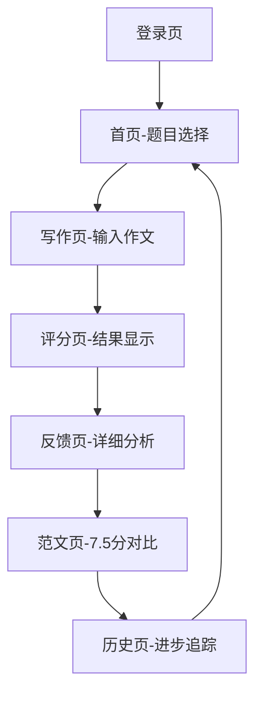

# 雅思写作MVP产品PRD

## 🎯 产品范围
**目标用户**：26-45岁职场人士，备考雅思写作，目标7.5分  
**核心功能**：AI评分 + 详细反馈 + 7.5分范文对比 + 进步追踪  
**明确不做**：Task 1、社区、付费、离线模式、多设备同步

## 🔄 完整用户流程

## 📱 页面详细设计

### 1. 登录页
- **元素**：Logo + 标题 + 微信登录按钮
- **跳转**：点击登录 → 首页

### 2. 首页（题目选择页）
- **顶部**：用户头像 + 今日练习次数
- **主体**：题目卡片列表
  - 每个卡片显示：题目 + 题型标签 + 上次得分
- **底部**：Tab栏（首页|历史|我的）

### 3. 写作页（输入作文页）
- **顶部**：返回按钮 + 题目展示（固定）
- **主体**：大文本输入框（显示词数统计）
- **底部**：提交评分按钮（灰色→蓝色可点击）

### 4. 评分页（结果展示页）
- **顶部**：总分大卡片（7.5分制，精确到0.5）
- **主体**：四项维度雷达图
  - Task Response: X/9
  - Coherence & Cohesion: X/9
  - Lexical Resource: X/9
  - Grammatical Range & Accuracy: X/9
- **底部**：查看详细反馈按钮

### 5. 反馈页（详细分析页）
- **顶部**：返回按钮 + 作文标题
- **主体**：逐句分析
  - 原文句子（有问题标红）
  - 问题类型标签（词汇/语法/逻辑/论证）
  - 具体修改建议
- **底部**：查看7.5分范文按钮

### 6. 范文页（7.5分对比页）
- **顶部**：题目 + 返回按钮
- **主体**：7.5分范文全文展示
- **底部**：返回首页按钮

### 7. 历史页（进步追踪页）
- **顶部**：统计卡片
  - 总练习次数
  - 当前平均分
  - 距离7.5分差距
- **主体**：分数趋势折线图
- **底部**：最近练习列表（时间+分数+题目）

## 🎯 功能详细说明

### AI评分功能
- **输入**：用户作文文本（250-300词）
- **输出**：总分 + 四项维度分数
- **限制**：仅支持Task 2
- **响应时间**：≤5秒

### 详细反馈功能
- **逐句标注**：标红问题句
- **错误分类**：词汇/语法/逻辑/论证 四色标签
- **修改建议**：每句提供1-2个具体修改方案

### 7.5分范文功能
- **内容**：针对每个题目的高质量范文
- **展示**：全文展示，无交互

### 进步追踪功能
- **数据**：练习次数、平均分、距离7.5分差距
- **图表**：最近7次练习分数折线图
- **列表**：按时间倒序的练习记录

## 🚫 明确排除功能
- Task 1评分
- 个性化学习建议
- 社区互动功能
- 离线使用
- 多设备数据同步
- 任何付费功能